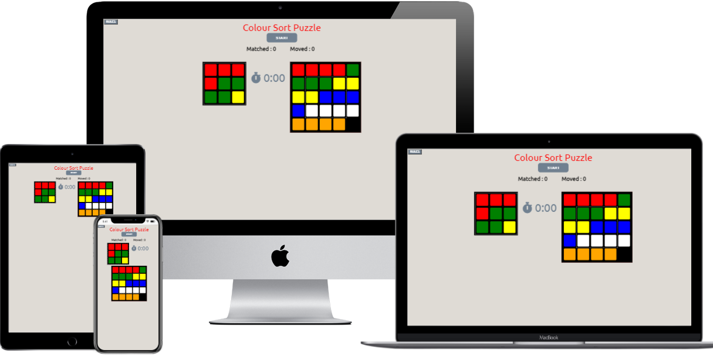
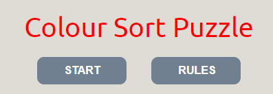
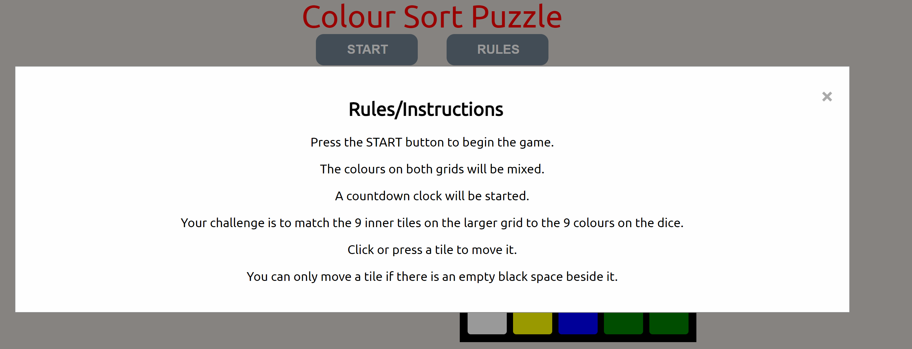
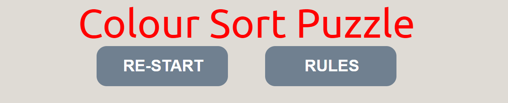
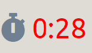
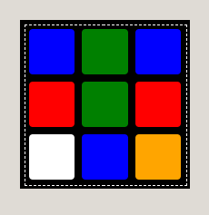
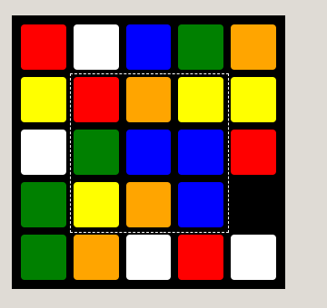
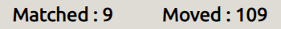
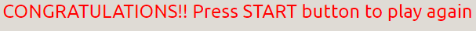
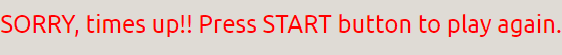

# Colour Sort Puzzle

## Introduction

The Color Sort Puzzle is a game of skill and speed. The user is presented with a grid of 24 colour tiles. On the grid, there are 6 different colours with 4 tiles of each colour. There is a space on the grid to allow users to move the coloured tiles around the grid. There is also a mini grid or dice of nine coloured tiles displayed on screen and the aim of the game is for the player to match the inner 9 tiles on the main grid with the 9 colour tiles on the mini grid/dice.

Once the user clicks a start button, the tiles on the mini grid/dice and the main coloured grid will be mixed. A countdown of five minutes will start.The player can move the tiles on the main grid by clicking on the tile on a desktop or by touch on an ipad or mobile. The only moveable tiles will be the ones beside the empty space.

Once the colour tiles are matched the timer will stop and a congratulatory message will be displayed at the bottom of the screen. If, however, the time runs out before all nine tiles are matched, a 'times up' message will be displayed. The user is given an option to play again by pressing the start button. 

There is also an instruction button at the top of the screen. Once this button is pressed a modal window with instructions will explain the rules of the game. There will be an exit from this window back to the game.

## Design Process
The inspiration for this project came from a game called Rubiks Race.

 This game is in our home for many years and all members of the family, big and small have had hours of enjoyment playing it. With the physical game you can play against another player. The first to solve the puzzle by matching the nine inner tiles on a colour grid to the nine colours that appear on the dice wins. I adapted this game for my project to play against a timer countdown.
I set up a test repository to test if I could build the grid of colours using javascript. Some of the challenges in the javascript module with Code Institute also gave me inspiration. There are challenges with coloured tiles and clickable buttons. 

### Wireframes
[Wireframes](https://github.com/Catrionamcd/Colour-Sort-Puzzle/tree/master/assets/wireframes)
## Features

### Existing Features

#### Rules/Instructions
A rules button is displayed beside the start button at top of the screen.

Once clicked the player will be presented with a modal window with the game rules or instructions. The player can exit this window and return to the game by pressing the 'x' on the top right hand side of the window or simply by clicking outside the window.

Code used and amended from W3Schools, the link is :
   https://www.w3schools.com/howto/howto_css_modals.asp

#### Start/Restart Button
Once the player presses the START button the colour tiles will be mixed up on both grids. The counters of tiles matched and tiles moves will be reset.

The button will change to a RE-START button and a countdown timer will start counting down from 5 minutes.

#### Timer
As soon as the start button is pressed the timer will start counting down from five minutes, as soon as 30 seconds are reached the time will be displayed in red.
 

#### Colour Dice Grid

This is the smaller of the two colour grids. It is made up of nine coloured tiles, in three rows and three columns. Once the START button is pressed the colours on this dice will be mix up. These are the colours that have to be matched.

#### Main Colour Grid

This is the main section of the game. This is where the player will move the colour tiles around the grid to try match the colours on the dice grid. On a desktop the tiles can be moved by clicking on them. On other devices the tiles can be moved by touch. There are six different colours with four tiles of each colour. There is also a blank space to allow the player to move the tiles around the grid. Only tiles beside the blank space can be moved. If a tile, that is not beside a blank space, is clicked, the tiles will shake to alert the user that this tile cannot be moved. 

For the shake effect, code was used and amended from W3Schools, the link is :
https://www.w3schools.com/howto/tryit.asp?filename=tryhow_css_image_shake
   
The tiles that have to match the dice tiles are the nine inner tiles. A dotted line border, the same as the dotted line border around the dice, is displayed around this area to inform the player that these are the tiles that have to be matched. 

 

#### Game Progress

Along with the timer countdown, the player is also shown how many tiles are matched as they are playing the game and how many tiles have been moved in the game. If the player wants to play again they can try improve on their time or maybe the amount of tiles it took to complete the game.

#### End Of Game Messages

If the player matches all nine inner tiles within the 5 minutes, the game will stop, a congratulatory message will be displayed. The time taken to match all nine tiles will be displayed on the screen along with the number of tiles matched and the tiles moved to achieve that match. The re-start button will be set back to start.

If, however, the player is unable to match all nine tiles within the five minutes, a message will be displayed to inform them and they will get a chance to play again.

### Features Left to Implement
* Leader Board Page - In the original desgin of the game, I had hoped to allow the user to enter their name and their scores, time taken to complete the puzzle and the amount of moves made. These details would be displayed on a Leader Board screen with a list of other players. I had planned to display up to 6 names. This list would only be stored for the duration of the game.
### Future features
* Levels of difficulty - the player could be presented with a choice as to  what level of difficulty they would like to play. This could be determined by the countdown time. There could be three different levels with a different countdown time for solving the puzzle. I have a countdown of 5 minutes, that could be the intermediate level. For those who need a bit more time, possible 7 minutes and for those that really would like a challenge, possible 3 minutes.

* The amount of coloured tiles could be extended.
* The coloured tiles could display images like cartoon characters for younger players to try match.

## Technologies
### Languages Used
* HTML5
* CSS3
* JavaScript
### Framework, Libraries, Programs Used
* Balsamiq - Balsamiq ws used to create all wireframes designs for the game including desktop, iPad & mobile.
* Google Fonts - The Ubuntu font was used on all text in the game.
* FontAwesome - An icon of a stopwatch was used as a symbol beside the time as its counting down from five minutes.
* GitPod - Git was used for version control by utilizing the Gitpod terminal to add and commit changes with messages to Git and Push to GitHub.
* GitHub - used to store the project code and deploy the project.
* PicResize - The images of the physical game were reduced in size using PicResize.
* Google Chrome Dev Tools - this was used to display console.log while debugging JavaScript code. It was also used to test reponsiveness for the game and how it rendered on the different size devices.

## Testing

#### Rules/Instructions
* When the rules button is clicked a modal window should appear with the rules/instruction of the game.
* Check once the 'x' to exit the window is pressed the window is closed.
* If a player clicks outside the window check that the window closes.

#### Start Button
* Test that both colour grids mix when the start button is pressed and the timer countdown begins.
* Test that the start button becomes a re-start button once the game commences.
* If the re-tart button is pressed in the middle of a game, the game should re-commence. All counters reset and timer starts again.
* Test that it reverts to a start button when the game finishes.

#### Main Colour Grid

* Test that all six colours are being displayed in the main colour grid and that there is only four of each colour.
* Test random mix of colours.
* Make sure there is a blank space for movement of tiles.
* Allow tiles to move but only tiles beside the blank space.
* If a tile that is not beside a blank space is clicked ensure that the tile shake function is executed to alert the player that this is a wrong move.
* Make sure that the tile moves into the position of the blank space.
* Each time a tile is move a check will have to occur to see if the nine inner tiles are matching the dice tiles that are stored in an array.
* If all nine inner tiles match the dice tiles, ensure that the timer ends and a message is displayed, otherwise game continues.

#### Dice Grid

* Test random mix of colours.
* Ensure that each colour does not exceed 4 coloured tiles.
* Make sure the colours are stored in an array for comparison with the nine inner tiles on the  main colour tile grid everytime a tile is moved in the main grid.

#### Counters
* Test that each time a tile is move the tile move counter accumulates.
* Test that each time a tiles is matched that the tile matched counter accumulates.

#### Timer
* Ensure that the time is counting down properly.
* Once the timer hits 30 seconds on the countdown the time displayed should turn red.
* Once time reaches zero the game stops and a message is displayed.

#### Messages
* Ensure the correct message is being displayed depending on the outcome of the game.
* Once the game is re-started the message should no longer appear on the screen.

### Validator Testing
HTML
* No errors were found in the code when passing through the W3C Markup Validation Service,
[HTML](https://validator.w3.org/)

CSS
* No errors were found in the code when passing through the official (Jigsaw) validator,
 [CSS](https://jigsaw.w3.org/css-validator/)

 JavaScript
 * No errors were found in the code when passing through the JSHint, a JavaScript Code Quality Tool,
 [JavaScript](https://jshint.com/)

### Bug Fixes

#### Dice Colour Grid

## Deployment
The site was deployed to GitHub pages. The steps to deploy the site are :

* Opened GitHub & selected the Colour-Sort-Puzzle repository from the repositories listed on the left hand side of the screen.

* Within the Colour Sort Puzzle repository select the settings button at the top right hand side of the screen.

* In the settings page, scroll down & choose the Github pages. 
* In the Github page select a source of master as a branch name
from the source section drop-down menu.
* Once the branch name is selected click save.

The deployed link will be published at the top of the GitHub page.
The live link can be found here - https://catrionamcd.github.io/Colour-Sort-Puzzle/

## Credits

### Content

### Media