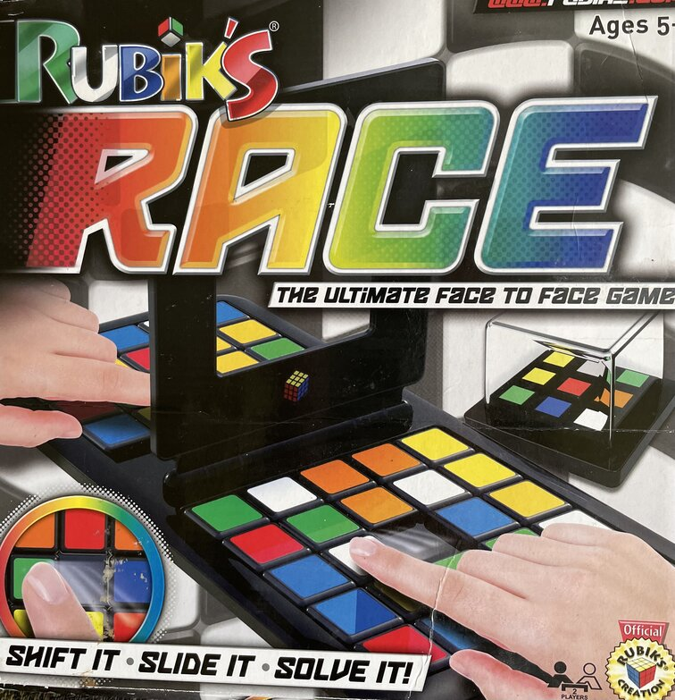

# Colour Sort Puzzle

## Introduction

The Color Sort Puzzle is a game of skill and speed. The user is presented with a grid of 24 colour tiles. On the grid, there are 6 different colours with 4 tiles of each colour. There is a space on the grid to allow users to move the coloured tiles around the grid. There is also a mini grid or dice of nine coloured tiles displayed on screen and the aim of the game is for the user to match the inner 9 tiles on the main grid with the 9 colour tiles on the mini grid/dice.

Once the user clicks a start button, the tiles on the mini grid/dice will be shuffled. A countdown of five minutes will start and the player can move the tiles on the main grid by clicking on the tile on a desktop or by touch on an ipad or mobile. The only moveable tiles will be the ones beside the empty space.

Once the colour tiles are matched the timer will stop and a congratulatory message will be displayed at the bottom of the screen. If, however, the time runs out before all nine tiles are matched, a 'times up' message will be displayed. The user is given an option to play again by pressing the start button. 

There is also an instruction button at the top of the screen. Once this button is pressed a modal window with instructions will explain the rules of the game. There will be an exit from this window back to the game.

## User Stories
## Design Process
The inspiration for this project came from a game called Rubiks Race.

 This game is in our home for many years and all members of the family. big and small have had hours of enjoyment playing it. With the physical game you can play against another player. The first to solve the puzzle wins but it can be played solo. I adapted this game for my project to play against a timer countdown.

### Wireframes
[Wireframes](https://github.com/Catrionamcd/Colour-Sort-Puzzle/tree/master/assets/wireframes)
## Features

### Existing Features

### Features Left to Implement
* Leader Board Page - In the original desgin of the game, I had hoped to allow the user to enter their name and their scores, time taken to complete the puzzle and the amount of moves made. These details would be displayed on a Leader Board screen with a list of other players. I had planned to display up to 6 names. This list would only be stored for the duration of the game.
### Future features
1. Levels of difficulty - the player could be presented with a choice as to  what level of difficulty they would like to play. This could be determined by the countdown time. There could be three different levels with a different countdown time for solving the puzzle. I have a countdown of 5 minutes, that could be the intermediate level. For those who need a bit more time, possible 7 minutes and for those that really would like a challenge, possible 3 minutes.

2. The amount of coloured tiles could be extended.
3. The coloured tiles could display images like cartoon characters for younger players to try match.

## Technologies
### Languages Used
* HTML5
* CSS3
* JavaScript
### Framework, Libraries, Programs Used
* Balsamiq - Balsamiq ws used to create all wireframes designs for the game including desktop, iPad & mobile.
* Google Fonts - The Ubuntu font was used on all text in the game.
* FontAwesome - An icon of a stopwatch was used as a symbol beside the time as its counting down from five minutes.
* GitPod - Git was used for version control by utilizing the Gitpod terminal to add and commit changes with messages to Git and Push to GitHub.
* GitHub - used to store the project code and deploy the project.
* PicResize - The images of the physical game were reduced in size using PicResize.

## Testing

### Validator Testing

### Bug Fixes

## Deployment

## Credits

### Content

### Media